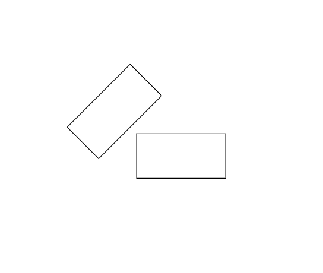

<h1>COLLISION DETECTION ACCOUNTING FOR AGENT DIMENSIONS</h1>

---

**Contents**:

- [Key task](#key-task)
- [Basics of the approach](#basics-of-the-approach)
  - [Parameters necessary to be stored/obtained](#parameters-necessary-to-be-storedobtained)
  - [EXTRA: Encoding minimum padding](#extra-encoding-minimum-padding)
- [Difference from previous overlap detection method](#difference-from-previous-overlap-detection-method)
- [Conceptual solution](#conceptual-solution)

---

# Key task
Account for the agent's size/dimensions:

- Obstacle detection (static and dynamic)
- Pathfinding
- For any orientation of the agent and obstacle(s)

# Basics of the approach
How?

- Consider all 4 corner coordinates of an obstacle cell
- Consider all 4 corner coordinates of agent bounding box

Hence, obstacle detection would be done at least partly in coordinate space rather than only grid space. The key idea is to detect overlaps between the agent's bounding box and the obstacle cells/other agents; bounding boxes.

---

To aid in this, some suggestions:

Fix grid cell dimensions such that they accurately cover the actual obstacles defined in the coordinate space. Plus, ensure that the algorithm, optimisations and related solutions do not count on precise measurements; hence, a bit of rounding error due to "grid-ficiation" would be acceptable.

## Parameters necessary to be stored/obtained
- Agent position as coordinates
- Exact agent dimensions
- Exact agent orientation (e.g. via the direction vector)
- All 4 corner coordinates of an obstacle cell
- All 4 corner coordinates of agent bounding box

## EXTRA: Encoding minimum padding
Minimum distance between agents and obstacles can be encoded by simply enlarging the agent's bounding box temporarily.

# Difference from previous overlap detection method
The overlap detection and resolution method implemented for hybrid patterns (see: [`solutions-documentation`/`key-solutions-for-hybrid-patterns.md`](../solutions-documentation/key-solutions-for-hybrid-patterns.md)) assumed that all boxes were axis-aligned (i.e. their edges were parallel to the x and y axes). As it turns out, this assumption greatly simplifies the overlap resolution process. To understand how, consider that under this assumption, it is sufficient to show that any vertical and horizontal edge of one box overlaps with any vertical and horizontal edge (respectively) of the other box on the x and y axes (also respectively). Also consider how, without this assumption, we can see examples where the above holds true yet the boxes do not overlap. An example is given below:

Clearly, we need a different approach to detect overlaps between rectangles that may be rotated with respect to the x and y axes. To this end, we can use the [Separating Axis Theorem (SAT) approach](../solutions-documentation/overlap-detection-for-straight-edged-convex-figures.md).

# Conceptual solution
See [Collision Detection](../solutions-documentation/collision-detection.md).